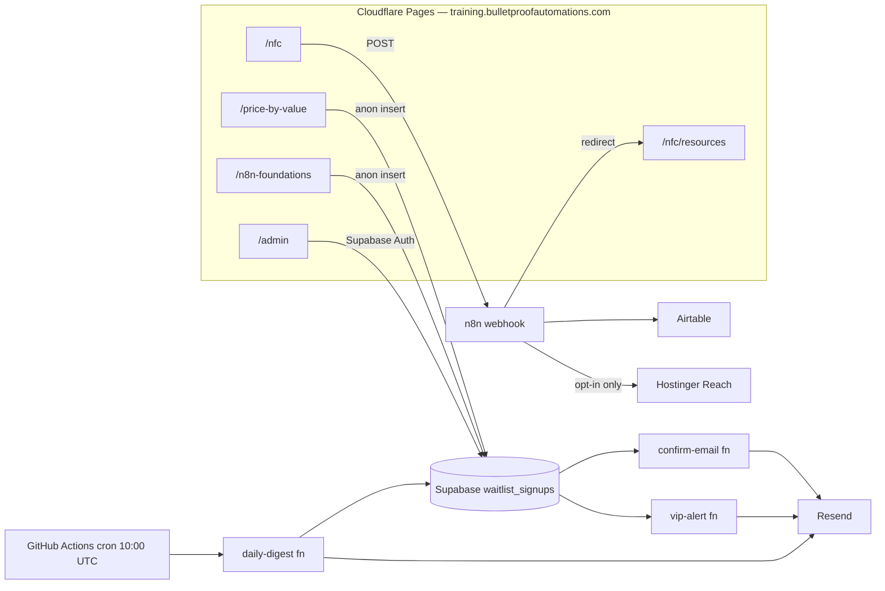

# Bulletproof Automations Training

The complete training website and lead-capture platform for `training.bulletproofautomations.com`, the training arm of Bulletproof Automations, founded by Johnathan Lightfoot (n8n Ambassador, Ghana).

This is a plain static HTML/CSS/JavaScript site with no framework and no build step, backed by a production stack of Supabase, Resend, GitHub Actions, self-hosted n8n, Airtable, and Hostinger Reach. It is deployed on Cloudflare Pages and is deliberately separate from the main website at `bulletproofautomations.com`.

The repo powers three funnels:

- Price by Value: a paid, Ghana-focused, in-person workshop with a full waitlist, VIP-alert, and admin CRM system.
- The n8n Automation Builder Pathway: a structured training ladder, starting with the free 8-week n8n Foundations cohort and its interest list.
- NFC lead capture: a physical-world funnel for NFC cards and NFC-enabled coffee cups.

## Architecture at a Glance

## Site Structure / Routes

Routes are folder-based, using files like `route/index.html`.

| Route | Purpose |
| --- | --- |
| `/` | Training hub homepage: featured, new, and coming-soon workshops. |
| `/price-by-value` | Price by Value workshop landing page and waitlist form. |
| `/n8n-automation-builder-pathway` | The builder ladder: Beginner, Intermediate, Advanced, Use Case, and Builder Pool. |
| `/n8n-foundations` | Free 8-week beginner cohort page and interest-list form. |
| `/thank-you` | Post-signup confirmation page. |
| `/admin` | Private waitlist admin dashboard with Supabase Auth. |
| `/nfc` | NFC lead-capture entry page. |
| `/nfc/resources` | Post-submit resource hub. |

Shared styling lives in `assets/css/style.css`, and shared JavaScript lives in `assets/js/main.js`. Standalone pages, such as `/nfc`, may include page-local CSS.

## Funnel 1: Price by Value Waitlist System

`/price-by-value` promotes the Price by Value workshop: how to price AI automations and n8n workflows based on business value instead of hours worked, built for the Ghana market with GHS price tiers, Mobile Money as a payment method, and real Ghana examples.

Signup flow:

1. Visitor opens `/price-by-value`, optionally with `?source=` for attribution, such as `?source=linkedin`; the default is `direct`.
2. The form inserts a row into the Supabase `waitlist_signups` table using anonymous, insert-only RLS.
3. Duplicate signups are blocked at the database level: unique per workshop on email, case-insensitive, and on WhatsApp number. The visitor sees an "already on the waitlist" message.
4. The client fires the `confirm-email` Edge Function best-effort to send a Resend confirmation. It never blocks the signup.
5. If VIP pricing-review interest is Yes, the `vip-alert` Edge Function emails the owner the full lead profile.
6. Visitor is redirected to `/thank-you`.

Workshop capacity is tracked against a target of 20 seats with `TARGET_SEATS`.

## Funnel 2: n8n Training Pathway & Foundations Interest List

`/n8n-automation-builder-pathway` describes a five-rung ladder: Beginner, Intermediate, Advanced, Use Case cohorts, then Builder Pool Review. It includes certificates of completion and eventual consideration for the AI Automation Builder Pool.

Standards are explicit: hands-on work, proof of work, local-first setup, attendance standards, and no parachuting into later rungs.

The first rung is n8n Foundations at `/n8n-foundations`: a free, online, portfolio-first 8-week cohort on Saturdays from 11:30 AM to 1:00 PM GMT, plus a Thursday setup pre-session so class time goes to building instead of installation.

The prescribed setup is local n8n with Docker, with the n8n Cloud trial as a fallback. Every week produces a portfolio artifact: exported workflow JSON, screenshots, notes, or a README.

Its interest list reuses the same Supabase waitlist system with `workshop_slug = 'n8n-foundations'` plus two extra fields: `interested_class` and `preferred_setup`. Confirmation emails are workshop-aware and make clear that the interest list does not reserve a seat; meeting links go only to confirmed registrants.

## Funnel 3: NFC Lead Capture Flow

The NFC flow is used by NFC cards and NFC-enabled coffee cups.

1. A visitor taps the NFC item and opens `/nfc`.
2. The visitor submits name, email, optional phone/WhatsApp, what they are looking for, and an optional email opt-in.
3. The form posts to the n8n webhook configured in `nfc/index.html`: `https://n8n.bulletproofautomations.com/webhook/nfc-lead-capture`.
4. n8n creates an Airtable lead record for every submission.
5. If email opt-in is checked, n8n creates a Hostinger Reach contact and then updates the Airtable Reach Status.
6. The n8n webhook response redirects the visitor to `/nfc/resources`. The redirect lives in the n8n workflow, not in this repo.

Campaign tracking: `/nfc` supports a `campaign` query parameter that overrides the hidden campaign field.

- Coffee cup: `/nfc?campaign=n8n-ambassador-cup`
- NFC card: `/nfc?campaign=n8n-ambassador-card`
- Default campaign: `n8n-ambassador`

The `source` field stays `nfc-card`, and `entry_page` stays `/nfc`.

`/nfc/resources` links to n8n training registration, n8n community resources, the GitHub profile, the Bulletproof Automations homepage, the ScriptureFlow demo app and developer pages, a downloadable vCard at `assets/johnathan-lightfoot.vcf`, and Calendly booking.

## Backend Architecture

### Supabase Database

`supabase-setup.sql` defines a single `waitlist_signups` table for both Supabase-backed funnels, discriminated by `workshop_slug`.

It includes lead fields, sales-pipeline fields, CHECK constraints, eight query indexes, an `updated_at` trigger, and unique indexes for duplicate prevention. The script is idempotent and can be re-run after schema changes.

Sales-pipeline fields include status, ticket type, payment status, payment amount, payment reference, payment method, and notes.

Row Level Security:

- Anonymous users may only insert.
- Authenticated users may read and update.
- Recommended hardening is documented in the SQL: restrict authenticated policies to the admin user's `auth.uid()`.

### Supabase Edge Functions

Edge functions live in `supabase/functions/`.

| Function | Trigger | What it does |
| --- | --- | --- |
| `confirm-email` | Client, after signup | Sends a workshop-aware confirmation email via Resend. |
| `vip-alert` | Client, when VIP interest is Yes | Emails the owner the full lead profile. |
| `daily-digest` | GitHub Actions cron | Emails the owner stats, source/class/setup breakdowns, seats remaining, and the last 24 hours of signups grouped by workshop. |

### GitHub Actions

`.github/workflows/daily-digest.yml` runs at 10:00 AM GMT/UTC daily, and on manual dispatch, then calls the `daily-digest` function using repo secrets.

### Admin Dashboard

`/admin` includes Supabase Auth login with no fallback password, live stats, source/experience/price/VIP breakdowns, search and multi-facet filtering, a full pipeline edit modal, and filtered CSV export.

## Configuration & Secrets

See `.env.example` for the full list. In short:

- Frontend code in `assets/js/main.js` contains only the Supabase project URL and anon public key. These are browser-safe by design; RLS is the security boundary. Never place the service-role key in frontend code.
- Edge Function secrets: `PROJECT_URL`, `SERVICE_ROLE_KEY`, `RESEND_API_KEY`, `FROM_EMAIL`, `OWNER_EMAIL`. Custom Supabase secrets cannot use the reserved `SUPABASE_` prefix.
- GitHub Actions secrets: `SUPABASE_DAILY_DIGEST_URL`, `SUPABASE_SERVICE_ROLE_KEY`.

Do not commit API tokens, Airtable credentials, Hostinger credentials, Supabase service-role keys, Resend keys, or other private secrets.

## Deployment & Testing

- Hosting: Cloudflare Pages, no build command, output directory `/`, custom domain `training.bulletproofautomations.com`. The main `bulletproofautomations.com` deployment is untouched.
- `README_DEPLOYMENT.md`: full 14-step deployment runbook for Supabase, Resend domain verification, Edge Function deploys, Cloudflare Pages, and GitHub secrets.
- `DEPLOYMENT_CHECKLIST.md`: go-live checklist.
- `TEST_PLAN.md`: nine test scenarios covering signups, duplicates, VIP alerts, source attribution, admin flows, CSV export, the digest, and mobile responsiveness.

## Privacy / Consent

- All NFC form submissions are logged to Airtable.
- Only visitors who explicitly check the email opt-in box are added to Hostinger Reach.
- Waitlist and interest-list signups receive a single confirmation email.
- Interest-list membership does not reserve a seat.

## Roadmap

Coming-soon workshops from the homepage:

- Bulletproof Workflow QA
- Workflow Documentation for Client Handoffs
- n8n Production Readiness
