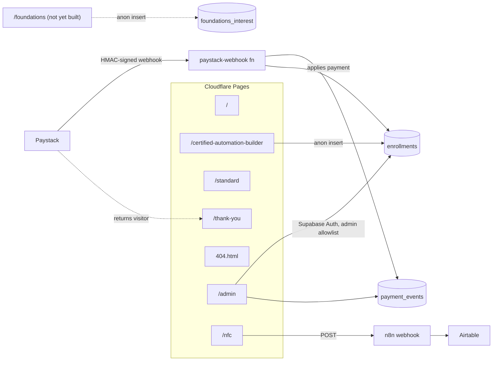

# Bulletproof Automations Training

The site for **[training.bulletproofautomations.com](https://training.bulletproofautomations.com)** — the
training and certification arm of Bulletproof Automations, an independent automation consultancy in
Accra, Ghana, run by Johnathan Lightfoot.

Plain static HTML, one stylesheet, vanilla JavaScript. **No framework and no dependencies** —
`package.json` has none, and there is no `node_modules`. The only build step is a copy-and-include
script. Deployed on Cloudflare Pages, backed by Supabase.

> **Bulletproof Automations is an independent training and certification provider.** It is not
> affiliated with, endorsed by, or accredited by n8n GmbH or any other vendor. n8n is referenced
> descriptively as the platform on which competence is currently assessed.

## What the site sells

One pathway, three stages. The distinction between stage 1 and stage 2 is the spine of the whole
product and is never blurred.

| Stage | Credential | Type | Status |
|---|---|---|---|
| 1 | Bulletproof Automation Foundations Certificate | Certificate of **completion** | Cohort 1 finishing |
| 2 | Bulletproof Certified Automation Builder (**BCAB**) | Professional **certification** — can be failed | Selling now |
| 3 | Bulletproof Certified Automation Engineer (BCAE) | Professional certification | Defined, not issued |

**Training and certification are separate products.** Completing a cohort qualifies a learner to
attempt the assessment; it does not award the credential. No page may imply otherwise.

The immediate commercial job is enrolling the founding BCAB cohort: 25 seats, starts
12 September 2026, enrollment closes 8 September 2026.

## Architecture


```mermaid
flowchart LR
  subgraph CF [Cloudflare Pages]
    HOME["/"]
    BCAB["/certified-automation-builder"]
    STD["/standard"]
    TY["/thank-you"]
    E404["404.html"]
    ADMIN["/admin"]
    NFCP["/nfc"]
  end

  BCAB -->|anon insert| ENR[(enrollments)]
  FND["/foundations (not yet built)"] -.->|anon insert| FI[(foundations_interest)]
  PS[Paystack] -->|HMAC-signed webhook| WH[paystack-webhook fn]
  WH --> PE[(payment_events)]
  WH -->|applies payment| ENR
  PS -.->|returns visitor| TY
  ADMIN -->|Supabase Auth, admin allowlist| ENR
  ADMIN --> PE
  NFCP -->|POST| N8N[n8n webhook] --> AT[Airtable]
```

Note the asymmetry: Paystack reaches the database **server-to-server**, and the visitor's browser is
never in the payment path. `/thank-you` only displays the reference from the return URL, because a
query string is typed by whoever holds the browser.

## Routes

Folder-based (`route/index.html`), links root-absolute.

| Route | Purpose | State |
|---|---|---|
| `/` | Pathway-centred front door | built |
| `/certified-automation-builder` | The BCAB credential, the cohort, and enrollment | built |
| `/standard` | The published competency framework, printable | built |
| `/thank-you` | Paystack return page: what happens next | built |
| `404.html` | Served with a real 404 status for unmatched paths | built |
| `/foundations` · `/pathway` · `/about` | Stage 1, the pathway, the instructor | not built |
| `/verify` · `/builder-pool` · `/privacy` | Credential lookup, hiring standard, data handling | not built |
| `/workshops` | Standalone workshops — **no occupant** since Price by Value retired | not built |
| `/admin` | Private enrollment dashboard (Supabase Auth) | built |
| `/nfc`, `/nfc/resources` | NFC lead capture. Own design, not in nav | carried |

`/n8n-foundations` and `/n8n-automation-builder-pathway` are pre-rebuild pages still being served
until their replacements exist. `_redirects` carries `/price-by-value → /` (workshop retired
10 August 2026).

## The build is a copy allowlist

`scripts/build.js` wipes `dist/` and copies a **hardcoded list** of paths. Nothing else ships — that
is what keeps `.git`, `supabase/`, docs and test plans out of production.

**A new route not added to `publicPaths` will work locally and 404 in production, with no build
error.** Routes may be declared before their files exist; the build skips them with a warning.

The same script resolves build-time includes — `<!-- include: header.html nav="bcab" -->` from
`partials/` — and substitutes `__SUPABASE_URL__` / `__SUPABASE_ANON_KEY__` from the environment.
**Includes resolve into `dist/` only**, so opening a source file directly shows raw comments and no
styling. Always check work through the build:

```bash
npm run build && npx --yes http-server dist -p 8080 -c-1
```

A build with `CF_PAGES` set and the Supabase values missing **exits 1** rather than shipping a dead
enrollment form.

## Backend

Three tables on the training Supabase project, each documented in a `supabase-*.sql` file at the
repo root. **Those files are documentation, not migrations — the live database is the source of
truth.**

| Table | Holds | Anon can |
|---|---|---|
| `enrollments` | The BCAB cohort roll | insert only |
| `foundations_interest` | Notify-me signups for the next Foundations cohort | insert only |
| `payment_events` | Append-only Paystack ledger, raw payloads kept | **nothing** |

Anon can never read any of them back, so every form must send `Prefer: return=minimal`. Reads and
updates are restricted to a single admin email allowlist. Nobody creates their own payment record.

`supabase/functions/paystack-webhook` verifies the `x-paystack-signature` HMAC-SHA512 over the raw
body, logs every event — including ones that fail verification or match no enrollment — then applies
money. `amount_paid_ghs` accumulates rather than overwrites, because instalments are paid in parts.
**Not yet deployed.**

`confirm-email` and `vip-alert` still point at the **old** Supabase project and belong to the
retired waitlist system. The daily digest was deleted on 10 August 2026.

## Documentation

Read these in order before changing anything:

| File | What it is |
|---|---|
| [CLAUDE.md](CLAUDE.md) | Terminology, immutable rules, voice, working rules. **Start here.** |
| [docs/build-status.md](docs/build-status.md) | Where the build actually is, conventions, blockers |
| [docs/project-brief.md](docs/project-brief.md) | Confirmed decisions — dates, prices, site map |
| [docs/competency-framework.md](docs/competency-framework.md) | **Canonical.** All weights, thresholds and legal wording |
| [README_DEPLOYMENT.md](README_DEPLOYMENT.md) | Deployment runbook |
| [OPS_NOTES.md](OPS_NOTES.md) | Hosting constraints and recovery |
| [TEST_PLAN.md](TEST_PLAN.md) | Manual test scenarios |
| [DEPLOYMENT_CHECKLIST.md](DEPLOYMENT_CHECKLIST.md) | Go-live checklist |

## Rules that override convenience

1. **Never imply n8n affiliation or endorsement.** Every footer carries the independence statement.
2. **Never write job-guarantee language.** Where the hiring standard appears, the non-guarantee
   wording from the framework appears on the same page.
3. **No waitlists and no "coming soon" cards.** Every open course gets real dates, a real price and a
   payment path. BCAE is named on `/pathway` only, with no date and no signup.
4. **Never invent dates, prices, testimonials or outcome statistics.** Use visible bracketed
   placeholders and flag them.
5. **Never write pricing that implies the credential is bought.** "Intermediate + BCAB Assessment",
   never "Get BCAB Certified — [price]".

## Deployment

Cloudflare Pages, production branch `main`, build `npm run build`, output `dist`. DNS at Namecheap.
**Merging to `main` deploys immediately.** Work on a branch.

The site was previously on Netlify. Do not reconnect it, and do not use `npx wrangler deploy`.
